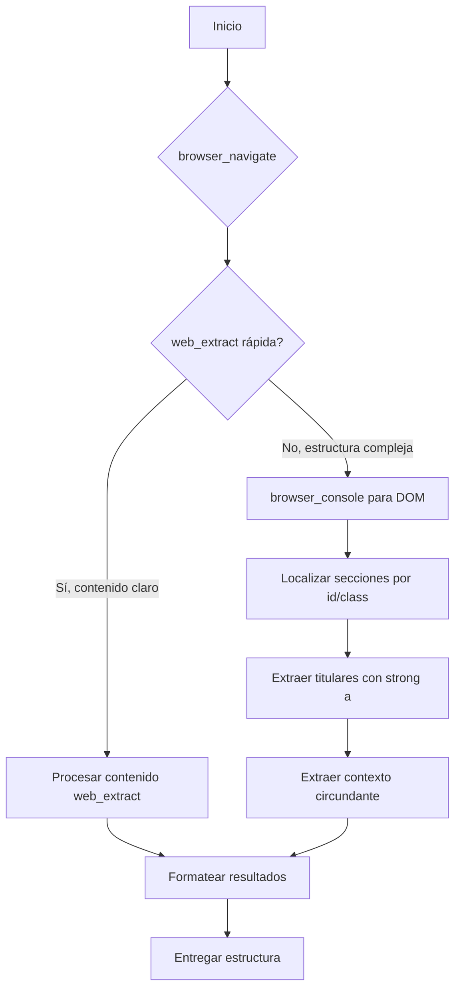

# Extracción de Noticias Web 📰

## Objetivo

Extraer noticias estructuradas de portales de noticias y agregadores como Techmeme, Hacker News, Reddit, y otros sitios con contenido jerárquico.

## Caso de Uso Común

El usuario solicita: "Navega a [URL] y extrae las N noticias principales con titular y contexto".

## Arquitectura del Enfoque

Usar un flujo de herramientas combinadas para manejar diferentes estructuras de sitios:



## Pasos Detallados

### Paso 1: Reconocimiento Inicial

```python
# Intentar primero con web_extract para obtener vista general
web_extract(urls=[target_url])

# Si el contenido es claro y estructurado, usar eso directamente
# Si es confuso o truncado, usar browser_navigate
```

### Paso 2: Navegación y Exploración del DOM

```python
browser_navigate(url=target_url)

# Buscar elementos clave
browser_console(expression="document.querySelectorAll('h1,h2,h3').forEach(h => console.log(h.textContent))")
browser_console(expression="Array.from(document.querySelectorAll('div[id]')).map(d => d.id).filter(id => id.includes('news') || id.includes('top') || id.includes('main'))")

# Para Techmeme específicamente:
browser_console(expression="(() => { const col = document.getElementById('topcol1'); if (!col) return 'no col'; const items = col.querySelectorAll('.item'); return Array.from(items).map(item => { const strong = item.querySelector('strong a'); return strong ? strong.textContent.trim() : 'no strong'; }).filter(text => text !== 'no strong'); })()")
```

### Paso 3: Extracción Estructurada

```javascript
// Script adaptable para extraer titulares y contexto
(() => {
  const container = document.getElementById('CONTAINER_ID') || 
                    document.querySelector('.CONTAINER_CLASS');
  if (!container) return [];
  
  const newsItems = container.querySelectorAll('.ITEM_SELECTOR');
  const results = [];
  
  for (let item of newsItems) {
    const headlineElem = item.querySelector('strong a') || 
                         item.querySelector('h3 a') ||
                         item.querySelector('a.headline');
    const headline = headlineElem ? headlineElem.textContent.trim() : '';
    
    // Contexto: tomar texto circundante excluyendo el titular
    const clone = item.cloneNode(true);
    if (headlineElem) {
      const toRemove = clone.querySelector('strong a') || 
                       clone.querySelector('h3 a') ||
                       clone.querySelector('a.headline');
      if (toRemove) toRemove.remove();
    }
    let context = clone.textContent.replace(/\s+/g, ' ').trim().substring(0, 200);
    
    if (headline) {
      results.push({ headline, context });
    }
  }
  return results.slice(0, LIMIT);
})()
```

### Paso 4: Formateo de Resultados

Crear estructura legible:

```
## Noticias Extraídas

1. **Titular:** [Título exacto]  
   **Contexto:** [Breve descripción, máximo 200 caracteres]

2. **Titular:** [Título exacto]  
   **Contexto:** [Breve descripción, máximo 200 caracteres]
...
```

### Paso 5: Fallbacks y Alternativas

Si no se encuentra estructura clara:

1. **Usar browser_vision** para análisis visual:
```python
browser_vision(question="Identifica las N noticias principales en la sección '[nombre]'. Para cada noticia, proporciona el titular exacto y una breve frase de contexto")
```

2. **Usar browser_vision con annotate=true** para obtener referencias interactivas:
```python
browser_vision(annotate=true, question="Localiza los titulares de noticias en la página y devuelve sus textos")
```
   - Los elementos anotados incluyen `[ref=eX]` que puedes usar con `browser_click` o `browser_type`
   - Útil cuando la página tiene muchos elementos interactivos y necesitas precisión visual

3. **Combinar web_extract con browser_snapshot**:
   - `web_extract` a menudo devuelve un resumen diario estructurado (ej: Techmeme)
   - `browser_snapshot(full=true)` obtiene todo el contenido textual de la página, incluso si el DOM está truncado
   - Cruzar ambas fuentes para validar y completar información

4. **Delegate a subagente** para procesamiento más complejo:
```python
delegate_task(
  goal="Analiza esta página web y extrae las N noticias principales con sus titulares y contexto",
  context="URL: [url]. Necesito extracción estructurada de noticias."
)
```

## Configuraciones Específicas por Sitio

### Techmeme
- Sección principal: `#topcol1`
- Items: `.item`
- Titulares: `strong > a`
- Patrón de contexto: Texto después de `strong` hasta los enlaces de fuentes
- **Script exacto para extraer titulares y contexto (DOM-based - RECOMENDADO):**
  ```javascript
  (() => {
    const topcol = document.getElementById('topcol1');
    if (!topcol) return 'no topcol1';
    // Extraer todos los strong a dentro de topcol
    const strongLinks = topcol.querySelectorAll('strong a');
    const news = [];
    for (let link of strongLinks) {
      const headline = link.textContent.trim();
      // Contexto: buscar guión en el elemento padre cercano
      let parent = link.parentElement;
      let context = '';
      while (parent && !context) {
        const text = parent.textContent;
        const dashIndex = text.indexOf('—');
        if (dashIndex !== -1) {
          context = text.substring(dashIndex + 1).trim().replace(/\s+/g, ' ').substring(0, 200);
        }
        parent = parent.parentElement;
      }
      news.push({ headline, context });
    }
    return news.slice(0, 3);
  })()
  ```
  Usar con `browser_console(expression=script)` después de `browser_navigate`. Si el contenido no se ve completo, usar `browser_scroll(direction='down')` antes. Este método es más robusto que buscar por header 'Top News'.
  
- **Alternativa cuando #topcol1 no existe:**
  ```javascript
  (() => {
    const bodyText = document.body.innerText;
    const idx = bodyText.indexOf('Top News');
    if (idx === -1) return [];
    let after = bodyText.substring(idx, idx + 8000);
    // Dividir por líneas y buscar las que contengan '—'
    const lines = after.split('\\n');
    const results = [];
    for (let i = 0; i < lines.length && results.length < 3; i++) {
      const line = lines[i].trim();
      if (line.includes('—')) {
        const parts = line.split('—');
        if (parts.length >= 2) {
          let headline = parts[0].trim();
          let context = parts[1].trim();
          const lastColon = headline.lastIndexOf(':');
          if (lastColon !== -1) {
            headline = headline.substring(lastColon + 1).trim();
          }
          headline = headline.replace(/\\s+/g, ' ');
          context = context.replace(/\\s+/g, ' ');
          if (context.length > 200) context = context.substring(0, 197) + '...';
          results.push({ headline, context });
        }
      }
    }
    return results;
  })()
  ```

- **Alternativa robusta (text‑based) cuando falla el DOM:**  
  Si los selectores DOM no funcionan (estructura cambiada o truncada), extraer directamente del texto plano usando fuentes conocidas (`CNBC:`, `Apple:`, `Mark Gurman / Bloomberg:`) y el guión largo como separador:

  ```javascript
  (() => {
    const bodyText = document.body.innerText;
    const idx = bodyText.indexOf('Top News');
    if (idx === -1) return [];
    let after = bodyText.substring(idx, idx + 4000);
    // Normalizar espacios no rotura
    after = after.replace(/\u00A0/g, ' ');
    const results = [];
    const sources = ['CNBC:', 'Apple:', 'Mark Gurman / Bloomberg:'];
    for (let source of sources) {
      const start = after.indexOf(source);
      if (start === -1) continue;
      let segment = after.substring(start);
      const nextMore = segment.indexOf('More:');
      if (nextMore !== -1) segment = segment.substring(0, nextMore);
      const dash = segment.indexOf('—');
      if (dash === -1) continue;
      let headline = segment.substring(source.length, dash).trim();
      let context = segment.substring(dash + 1).trim();
      // Limpiar saltos de línea y espacios extra
      headline = headline.replace(/\s+/g, ' ');
      context = context.replace(/\s+/g, ' ');
      if (context.length > 200) context = context.substring(0, 197) + '...';
      results.push({ headline, context });
    }
    return results.slice(0, 3);
  })()
  ```
  Este método es más resistente a cambios estructurales porque solo depende de patrones de texto visibles. Úsalo después de `browser_navigate` (no requiere scroll adicional). Si la página usa scroll infinito, considera un `browser_scroll(direction='down')` previo para cargar más contenido.

### Hacker News
- Items: `.athing`
- Titulares: `.titleline > a`
- Contexto: `.subtext` (puntos, usuario, tiempo)

### Reddit
- Items: `[data-testid="post-container"]`
- Titulares: `h3`
- Contexto: `.text-neutral-content`

## Consideraciones Técnicas

1. **Performance**: `web_extract` es más rápido que `browser_navigate` cuando el contenido es accesible
2. **Estructura DOM**: Siempre inspeccionar primero con `browser_console` simple
3. **Truncamiento**: Sitios como Techmeme pueden truncar snapshots; usar `browser_vision` como alternativa
4. **Limitaciones**: Evitar extraer más de 10 noticias por razones de contexto
5. **Combinación de fuentes**: Cuando el DOM es complejo, combinar `web_extract` (resumen estructurado) con `browser_snapshot(full=true)` (todo el texto) y `browser_vision(annotate=true)` (referencias visuales) para obtener información completa y precisa.
6. **Carga diferida**: Si la página no muestra todo el contenido inicialmente, usar `browser_scroll(direction='down')` una o dos veces antes de extraer datos. Esto es común en sitios con scroll infinito o carga progresiva.

## Plantilla de Comandos Reutilizable

```python
# Para extraer N noticias de cualquier sitio
def extract_news(url, limit=5):
    # Paso 1: web_extract rápida
    # Paso 2: browser_navigate si es necesario
    # Paso 3: browser_console para exploración
    # Paso 4: Extracción con JavaScript específico
    # Paso 5: Formateo
    return formatted_news
```

## Ejemplo de Uso Completo

```python
# Usuario pide: "Extrae 3 noticias principales de Techmeme"
browser_navigate(url="https://techmeme.com")
result = browser_console(expression="...script de extracción...")
# Procesar result y formatear
```

## Registro en Memoria

Para patrones recurrentes, guardar en memoria:

```python
memory(
  action="add",
  target="memory",
  content="Techmeme usa #topcol1 para noticias principales, con elementos .item que contienen strong > a para titulares. El contexto es el texto después del strong hasta los enlaces de fuentes."
)
```

## Recursos

- [MDN DOM API](https://developer.mozilla.org/en-US/docs/Web/API/Document_Object_Model)
- [Browserbase Documentation](https://browserbase.com/docs)
- [Hermes Agent Browser Tools](AGENTS.md#browser-tools)

---

*Skill creado basado en experiencia extraída de Techmeme el 2026-04-11*